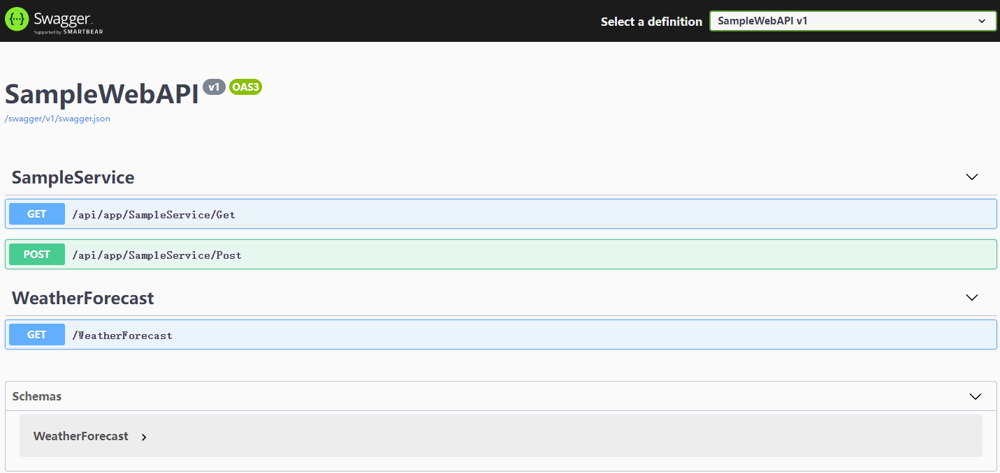

# EasyAPICore
The Controller API is automatically generated by convention

## Simplest Usage

1. Create ASP.NET Core WebApi(Or MVC) Project

   ```powershell
   dotnet new webapi -o SampleWebAPI
   ```

2. Install components via .Net CLI

   ```powershell
   dotnet add package EasyAPICore --version 1.0.3
   ```

3. Add new SampleService

   ```c#
   using EasyAPICore;
   using Microsoft.AspNetCore.Mvc;
   using System;
   
   namespace SampleWebAPI
   {
       public class SampleService : IEasyAPI
       {
           public BookReadDto Create(BookDto book)
           {
               return new BookReadDto
               {
                   Id = new Random().Next(1, 100),
                   Name = book.Name,
                   Description = book.Description
               };
           }
   
           public string Get(int id)
           {
               var dto = new BookReadDto
               {
                   Id = id,
                   Name = "Three body",
                   Description = "The Trisolaran Dark Forest"
               };
               return dto.ToString();
           }
   
           public string Delete(int id)
           {
               var dto = new BookReadDto
               {
                   Id = id,
                   Name = "Three body",
                   Description = "The Trisolaran Dark Forest"
               };
               return $"Delete {dto.ToString()} Success!" ;
           }
       }
   
       public class BookDto
       {
           /// <summary>
           /// Book Name
           /// </summary>
           public string Name { get; set; }
   
           /// <summary>
           /// Book Description
           /// </summary>
           public string Description { get; set; }
       }
   
       public class BookReadDto
       {
           /// <summary>
           /// Book Id
           /// </summary>
           public int Id { get; set; }
   
           /// <summary>
           /// Book Name
           /// </summary>
           public string Name { get; set; }
   
           /// <summary>
           /// Book Description
           /// </summary>
           public string Description { get; set; }
   
           public override string ToString()
           {
               return $"Book ID:{Id},Book Name:{Name},Book Description:{Description}";
           }
       }
   }
   ```

4. Registered EasyAPICore

   ```c#
   public void ConfigureServices(IServiceCollection services)
   {
   	 //Register Swagger
        services.AddSwaggerGen(c =>
        {
            c.SwaggerDoc("v1", new OpenApiInfo { Title = "SampleWebAPI", Version = "v1" });
   
             //Must Add this
              c.DocInclusionPredicate((docName, description) => true);
         });
         services.AddEasyAPICore();
   }
   ```

5. Add Middleware EasyAPICore

   ```C#
   app.UseEasyAPICore();
   ```

6. Run Sample

   ```powershell
   dotnet run
   ```

   

   

## Advanced Usage


## Reference project

Thanks for following project.

- [ABP](https://github.com/aspnetboilerplate/aspnetboilerplate)
- [Panda.DynamicWebApi](https://github.com/pda-team/Panda.DynamicWebApi)
